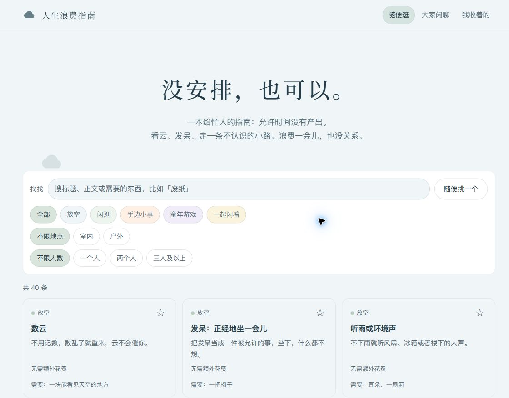

<p align="center">
  <a href="#先逛一会儿">在电脑上打开</a> ·
  <a href="shared/content.json">看看小事</a> ·
  <a href="https://github.com/kk-6788/life-idle-guide/issues/new">留一个想法</a> ·
  <a href="CONTRIBUTING.md">一起共建</a>
</p>

## 一个可以安心浪费时间的地方

生活里已经有很多事在催我们了。这里想留一点空白：看看云，发会儿呆，和朋友走一段没有目的的路。即使什么也没做，这一会儿也没有关系。

你可以挑一件小事，也可以只看看。没有打卡、排行、积分，不用交作业，也不用要求自己开心。



## 随便挑一件

目前有 **40 件小事**，适合一个人、两个人，也适合三人及以上一起闲着。大多数无需额外花费，少数需要预算的选择会说明费用。每件小事都有一句短句：

> 云没有赶路，今天你也可以。

网页里可以按类别、地点和人数找一找，随机挑一个，或把喜欢的小事收起来。收藏保存在当前浏览器里。内容库欢迎大家一起补充：现实中的童年游戏可以有，刷短视频、电子游戏和充值推荐不收录。

## 先逛一会儿

下载仓库后，使用已有的 Python 3，在项目根目录运行：

```bash
python -m http.server 8000 --bind 127.0.0.1
```

打开 [http://127.0.0.1:8000/web/](http://127.0.0.1:8000/web/)，就可以浏览、筛选、随机挑选和收藏，不需要账号或后台服务。请通过这个地址打开；网页需要读取内容文件，直接双击 HTML 不适用。

也可以将整个 `web/` 和 `shared/` 目录放到静态托管服务中，保持它们相邻的目录结构。**当前仓库提供源码，还没有配置在线网页地址。**

<details>
<summary>想在本机试试「大家闲聊」</summary>

Windows 可以双击 `启动网页.cmd`，或者在项目根目录运行：

```bash
python server/app.py
```

打开 [http://127.0.0.1:8765/](http://127.0.0.1:8765/)。留言和回复经本机管理员审核后展示，操作见 [使用说明](docs/使用说明.md)。静态模式的闲聊页会提示服务尚未开放。

这个服务只监听本机，供开发和测试使用；公开社区需要另外准备服务和审核机制。

</details>

## 一起添一点空白

想到一件小事，可以 [开一个 Issue](https://github.com/kk-6788/life-idle-guide/issues/new)，写下它的名字、怎么做、适合几个人、是否花钱。暂时写不完整也可以。

愿意直接修改内容的话，编辑 [`shared/content.json`](shared/content.json)，再提交 Pull Request。先看看 [内容规则](CONTENT_GUIDE.md) 和 [贡献指南](CONTRIBUTING.md)：建议温和一点，允许随时停下，也允许没有任何收获。

## 源码放在哪里

```text
web/       网页界面与交互
shared/    小事内容与筛选、随机逻辑
server/    可选的本机闲聊服务（Python 标准库 + SQLite）
tests/     内容、筛选与本机服务测试
docs/      使用说明、封面与网页截图
```

运行检查需要已有的 Node.js 和 Python 3：

```bash
node --test tests/guide.test.js
python -m unittest discover -s tests -p test_community.py -v
```

代码与文字的许可尚未确定，目前先公开源码。静态托管和公开社区的边界见 [上线前事项](docs/上线前事项.md)。

---

<p align="center">有空再来。没有空，也没关系。</p>
